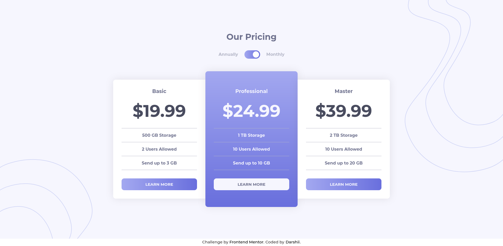

# Frontend Mentor - Pricing component with toggle solution

### The challenge

Users should be able to:

- View the optimal layout for the component depending on their device's screen size
- Control the toggle with both their mouse/trackpad and their keyboard

### Screenshot

### Links

- Solution URL: [Github Repo](https://github.com/darshii98/toggle-pricing-component)
- Live Site URL: [Github Pages](https://darshii98.github.io/toggle-pricing-component/)

### Built with

- Semantic HTML5 markup
- CSS custom properties
- Flexbox

## Author

- Github- [darshii98](https://github.com/darshii98/)
- Frontend Mentor - [@darshii98](https://www.frontendmentor.io/profile/darshii98)
